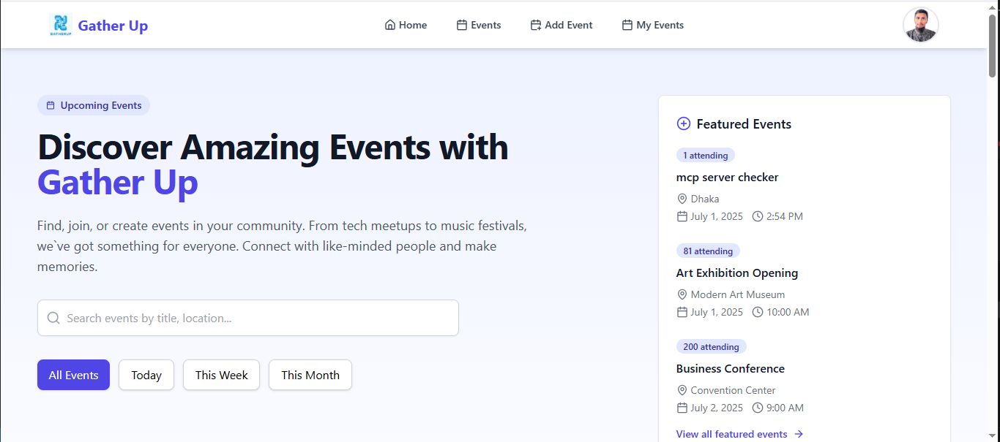

# 📅 Event Management Web Application

**Find, join, or create events in your community. From tech meetups to music festivals — we’ve got something for everyone. Connect with like-minded people and make memories.**

---

## 🚀 Live Demo

👉 [View Live](https://event-menagement.netlify.app/)



---

## 🛠️ Built With

- **Frontend:** React.js, Tailwind CSS
- **Backend:** Express.js, Node.js, MongoDB
- **Authentication:** Custom-built JWT system
- **Image Upload:** [imgbb](https://imgbb.com/)

---

## 📚 Project Overview

A fully functional **Event Management Web Application** built with the **MERN stack** (MongoDB, Express.js, React.js, Node.js).  
This project supports **custom authentication**, **dynamic event operations**, powerful **search/filter**, and an intuitive user interface.

---

## ✨ Key Features

### ✅ Navbar

- Logo + Website Name.
- Links: **Home**, **Events**, **Add Event**, **My Event**, **Sign In**.
- When logged in: Displays **profile picture**.
- Profile dropdown includes **User Name** (not clickable) and a **Logout** button.

---

### ✅ Homepage

- Modern, responsive custom design.
- Highlights the core value of the platform.

---

### ✅ Events (Private Route)

- Displays **all events** added through the “Add Event” page.
- Sorted in **descending order** by date/time — latest events come first.
- Each event card includes:
  - Event Title
  - Name (Who posted)
  - Date & Time
  - Location
  - Description
  - Attendee Count
  - **Join Event** button

> ✔️ Clicking **Join Event** increases the attendee count by 1.  
> ✔️ A user can join an event only once.

**Search & Filter System**

- Search by **event title**.
- Filter by:
  - Today’s date
  - Current week
  - Last week
  - Current month
  - Last month

---

### ✅ Add Event (Private Route)

- Add a new event with:
  - Event Title
  - Name (Who posted)
  - Date & Time
  - Location
  - Description
  - Attendee Count (defaults to 0)
- Image upload supported via **imgbb**.
- After submitting, the event is stored securely in **MongoDB**.

---

### ✅ My Event (Private Route)

- Displays all events **created by the logged-in user**.
- Each card shows:
  - Event Title
  - Name (Who posted)
  - Date & Time
  - Location
  - Description
  - Attendee Count
  - **Update** & **Delete** buttons

> ✔️ Update: Shows a form in a modal or separate route.  
> ✔️ Delete: Shows confirmation before deletion.

---

### ✅ Authentication

- **Custom-built** JWT auth system (no third-party auth).
- **Registration Page:** Name, Email, Password, PhotoURL.
- **Login Page:** Email & Password.
- Proper **error handling** for invalid credentials, missing fields, etc.

---

## 🔒 Private Routes

- `Events`, `Add Event`, `My Event` pages are protected.
- Users must be logged in to access these.

---

## 💻 Installation

1️⃣ Clone the client repo:

```base
https://github.com/Robiu-Sani/event-menagenment-client
cd event-menagenment-client
npm install
```

### create .env file or .env.local and add

VITE_SERVER = **_
VITE_IMGBB_API = https://api.imgbb.com/1/upload
VITE_IMGBB_API_KEY =_**
